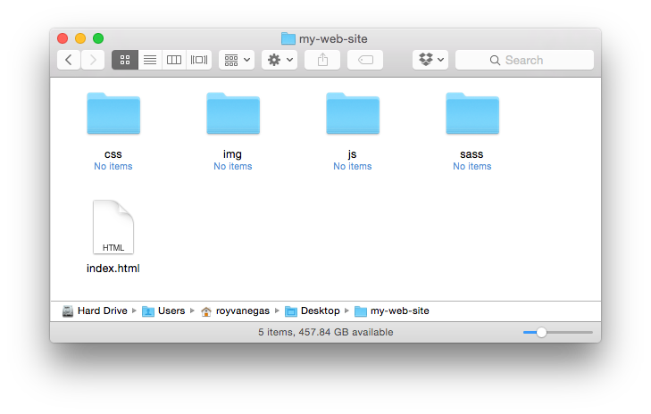

<meta charset="utf-8">
# RISD | Web Design | Portfolio Project

## Description
You’re building a portfolio-themed web site of your graphic/photographic work for your final project. If you don’t have work of your own to present in a portfolio, you have three options:

1. Use a friend’s, colleague’s, or family member’s work as the basis for your project.

2. Create a portfolio of some artist’s or designer’s work. (She or he can be alive or deceased.)

3. Produce a portfolio of compiled images from an image repository, such as Flickr.

I encourage you to consider both traditional web design elements (navigations on top, 960 pixel widths, etc) and non-traditional elements (navigation elements perhaps on the bottom, non-linear display of content, etc). Experiment.

Show your work to a friend or family member and note her/his initial reaction. Listen to their suggestions. Verify that what you want to communicate is actually being communicated.

## Questions to Consider
- What is the trend in pages that display similar content? How far can my design stray from that trend without affecting user experience (UX) negatively?

- Is the contrast between type and (back) ground balanced sufficiently to make reading easy? If not, can I justify why?

- Which typeface will help me to get my meaning across? If using more then one typeface, does each complement each other, and do they work harmoniously with the overall design?

- Is the space I use around content helping the user consume my design, or is it making her/him work hard at understanding my intentions?

- Which sections of the content are most important?

- What should be emphasized?

- Does the color scheme complement the message I’m trying to convey, or is it simply serving an aesthetic role in my design?

- Is my design communicating what I need it to?

- Is it easy to navigate?

## Rules
- Must be a multi-page site consisting of at least four pages: `home`, `about`, `contact`, `gallery/portfolio`.

- Must be under Git control.

- Must use a base style sheet at the top of the style sheet stack. The base style sheet can be authored by anyone, including yourself, but one *must* be present.

- CSS must be created via Sass.

- Must have an organized folder structure: images in a folder called `img`; JavaScript/jQuery files in a folder called `js`; fonts — should you use local web fonts — in a folder called `fonts`; Sass in a folder called `sass`; and, CSS in a folder called `css`. Your index page must be called `index.html`.

  Your index file and all folders must be in the root of your project folder. For example: 

- All HTML and CSS in lowercase.

- All JavaScript/jQuery in lowercase/camel case.

- No lorem ipsum content; that is, no filler content.

- HTML pages must validate. Use [the W3’s validator](http://validator.w3.org/#validate_by_input).

- Ensure the logical outlining of your document using [the HTML5 Outliner](http://gsnedders.html5.org/outliner/).

## Critique
We’ll spend a portion of the morning and all afternoon on Friday, 7 August, critiquing each other’s work.

## Due
Friday, 7 August, at 1:00 PM. **There are _no_ exceptions to this deadline, so budget your time accordingly.**

## Submission
1. Send an email to `risd@vanegas.org` with a URL to the GitHub repository.
